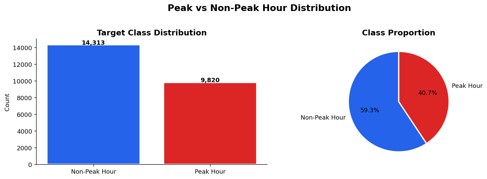
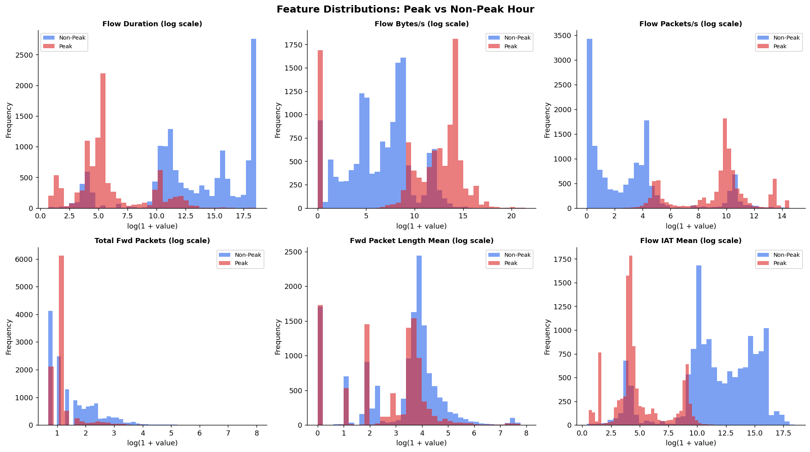
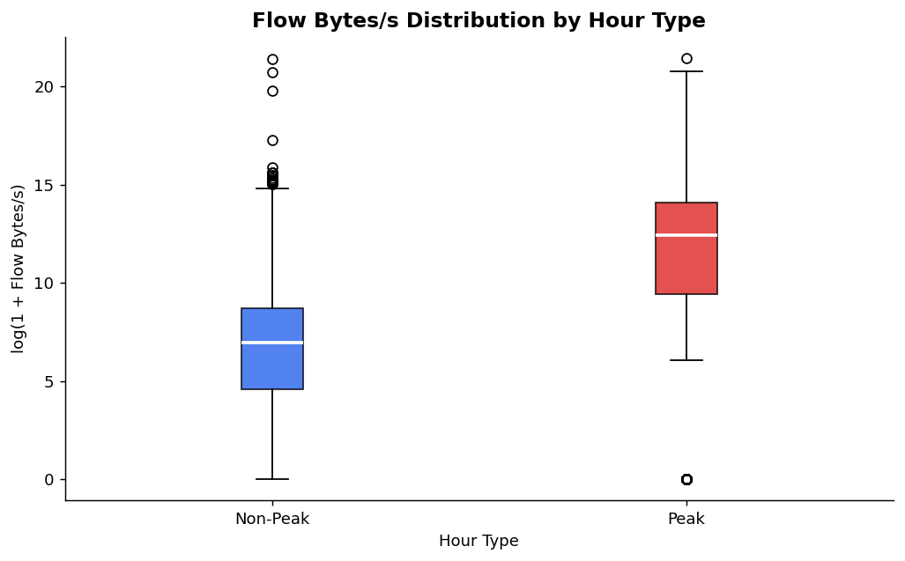
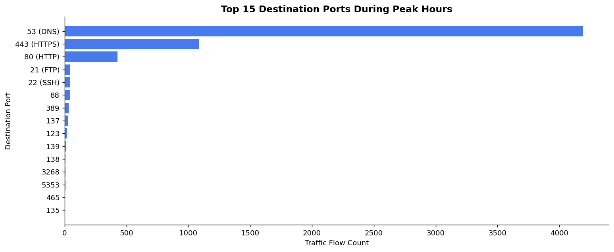
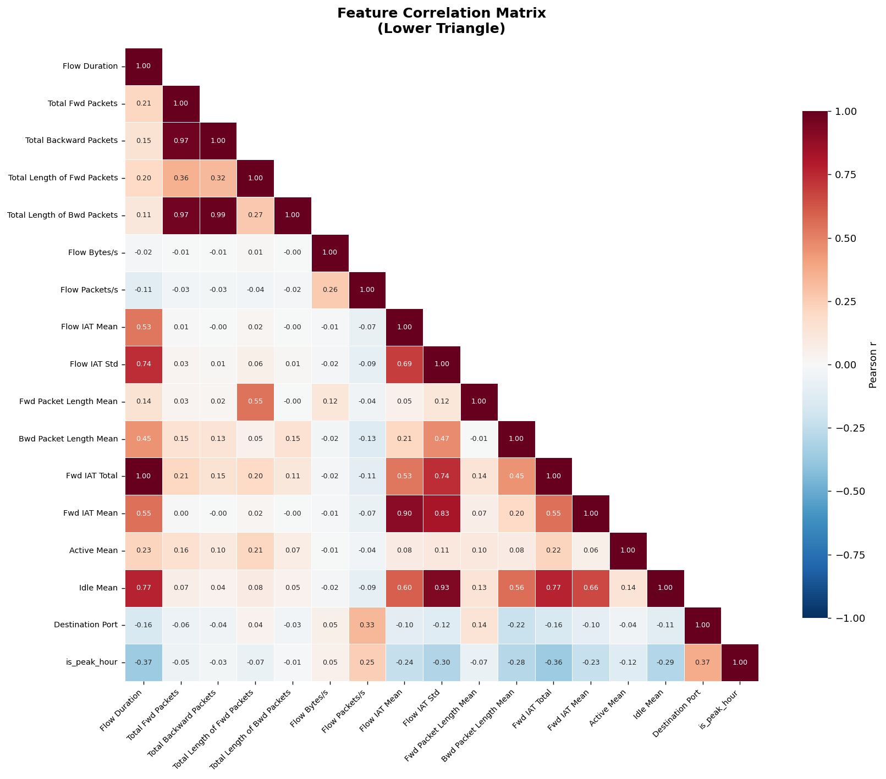
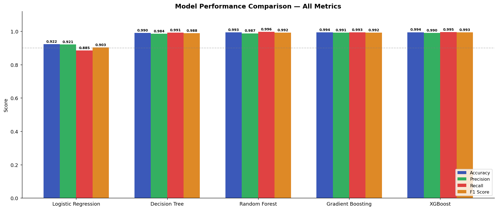
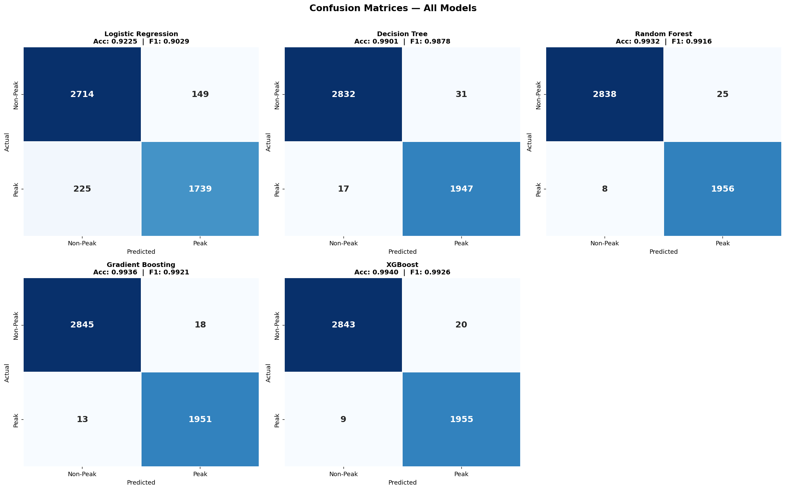
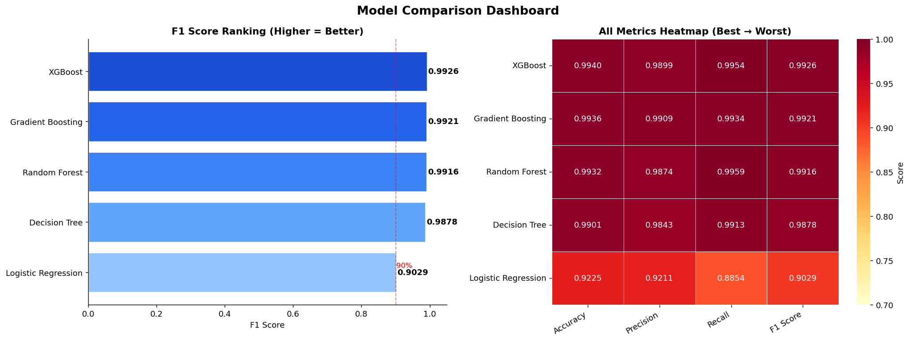
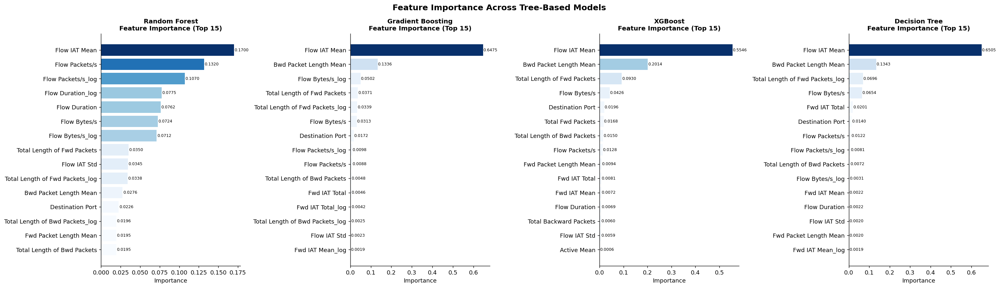

# Forecasting Peak-Hour Bandwidth Demand in a University Network

## Table of Contents
1. Executive Summary ............................................................................................................................................ 3  
2. Introduction ........................................................................................................................................................... 5  
3. Main Body ............................................................................................................................................................... 7  
3.1 Dataset .............................................................................................................................................................. 7  
3.2 Methodology ................................................................................................................................................... 8  
1. Dataset Acquisition: .................................................................................................................................. 8  
2. Data Preprocessing: .................................................................................................................................. 8  
3. Model Training: ........................................................................................................................................... 9  
3.3 Results and Findings ................................................................................................................................ 11  
4. Conclusion ............................................................................................................................................................ 15  
5. Recommendations ............................................................................................................................................ 16  
1. Application of New Deep Learning Architectures ..................................................................... 16  
2. Multi-Lingual Support and Dataset Expansion ........................................................................... 16  
6. References ............................................................................................................................................................ 18

---

## 1. Executive Summary
University networks are under continuous pressure to provide stable, high-throughput, low-latency connectivity to thousands of concurrent users whose activity patterns vary significantly by time of day, weekday, academic schedule, and service usage profile. In this project, a full machine learning workflow is developed to classify network flow instances as **Peak Hour** or **Non-Peak Hour**, with the broader objective of enabling proactive bandwidth planning, congestion prevention, and smarter operational decision-making in a university environment. The project is not only an analytical exercise but also a deployment-oriented system that includes model serving through FastAPI and a browser-based dashboard for practical use.

The implemented work uses CICIDS2017 flow-level data, which provides detailed network telemetry and traffic labels across multiple weekdays. A proportional sampling strategy is used to preserve distributional diversity across files while keeping training complexity manageable. The pipeline proceeds through strict cleaning and transformation steps, including duplicate elimination, type coercion, handling of infinity and missing values, sanity filtering, and log transformations for skewed variables. These stages directly improve model robustness and reduce the risk of unstable training behavior. The final clean dataset contains **24,133** records, split using a stratified 80/20 protocol into **19,306** training rows and **4,827** testing rows.

Five supervised classifiers are benchmarked under the same evaluation frame: Logistic Regression, Decision Tree, Random Forest, Gradient Boosting, and XGBoost. The strongest model is XGBoost, with **Accuracy = 0.9940, Precision = 0.9899, Recall = 0.9954, and F1 = 0.9926**. These values indicate strong discriminatory power on the current test distribution and low classification error for both classes. Comparative evaluation confirms that ensemble tree-based methods clearly outperform the linear baseline, which is expected for non-linear tabular traffic behavior.

From an academic quality perspective, this report presents methodology in two parts, as requested:  
1. **Current implemented pipeline** (exactly what has been built and evaluated in the notebook and deployment artifacts).  
2. **Improved best-practice pipeline** (timestamp-based peak-hour target construction) to strengthen methodological rigor and reduce target-design leakage risk.  

This dual treatment is important: it preserves project authenticity while still demonstrating research maturity. In the implemented pipeline, the target variable is engineered from traffic intensity behavior. While this produces very high predictive performance, it can partially couple label generation and predictors. Therefore, this report additionally formalizes a timestamp-based target framework where peak-hour status is derived from temporal policy windows (e.g., working-day time bands), not from throughput-derived predictors. This separation increases defensibility for academic review and future publication-quality extension.

Results are supported by the complete figure set generated in the project (`reports/figures`). The report explicitly maps each analytical claim to the corresponding figure: class distribution, feature distributions, bandwidth boxplot, destination-port analysis, correlation heatmap, metric comparison, confusion matrices, model ranking, and feature importance. This figure-to-text linkage ensures traceability and strengthens evidence quality.

Operationally, the project already demonstrates real-world readiness. The best model, feature schema, and metadata are exported and consumed by a FastAPI service exposing both single and batch prediction routes. The web interface enables user-driven scenario testing with confidence visualization. This final combination of strong empirical performance, transparent workflow, and deployment capability makes the work suitable for both academic submission and practical demonstration to technical stakeholders.

Finally, the report concludes with targeted recommendations in two mandated directions: (i) application of new deep learning architectures for temporal demand modeling, and (ii) multilingual and dataset-expansion strategies for broader institutional adoption. Together, these recommendations define a clear roadmap from a high-quality current system toward a research-grade forecasting platform with stronger generalization, explainability, and long-term lifecycle management.

---

## 2. Introduction
Digital campuses increasingly depend on uninterrupted network performance for teaching, assessment, administration, research computing, cloud collaboration, streaming lectures, video conferencing, and security monitoring. Unlike static enterprise traffic, university traffic has strong temporal and behavioral variability: predictable daytime academic peaks, short burst windows around class transitions, and irregular surges driven by content delivery and software update events. In this context, bandwidth management cannot rely only on static thresholding or reactive troubleshooting. By the time severe congestion becomes visible in traditional monitoring dashboards, user experience is already degraded. This motivates predictive, data-driven mechanisms for anticipating high-demand conditions before service quality drops.

This report addresses that challenge through a binary flow-classification formulation: determining whether a network flow belongs to a **Peak-Hour** or **Non-Peak-Hour** operating state. While the label appears conceptually simple, the quality of target design is central to scientific validity. A model that predicts a poorly defined target may still report high metrics but contribute limited operational value. Therefore, this report deliberately separates model performance discussion from target-engineering quality, and proposes a stronger temporal definition aligned with institutional usage policy.

The practical problem statement is as follows:  
Given flow-level telemetry from campus-like traffic, can a supervised model reliably infer whether the observed network state corresponds to peak demand periods, and can that inference be integrated into an operational API workflow?  

From a research and engineering standpoint, the project pursues six concrete objectives:
1. Build an end-to-end ML pipeline from raw CSV ingestion to deployable inference.
2. Perform robust preprocessing for noisy real-world network telemetry.
3. Engineer a usable target variable and evaluate methodological risks.
4. Benchmark multiple model families under a fair and consistent protocol.
5. Interpret model behavior using correlation and feature-importance evidence.
6. Package the best model in an accessible REST + UI prediction system.

The selected dataset, CICIDS2017, is a widely recognized benchmark in network intrusion and traffic analysis literature [1], [2]. Even though the dataset is commonly used for security classification, its rich flow statistics make it suitable for demand characterization when the target is carefully defined. The project uses eight working-hours files with proportional sampling to maintain coverage across multiple days and traffic conditions. This design decision matters because models trained on narrow daily subsets can overfit short-term artifacts and fail when campus behavior changes.

Methodologically, the project compares five established tabular learners. Logistic Regression serves as a transparent baseline; Decision Tree and Random Forest provide non-linear partitioning and ensemble stability; Gradient Boosting and XGBoost provide stronger functional approximation for high-dimensional non-linear interaction structures [3], [4], [5]. Evaluation uses accuracy, precision, recall, F1, confusion matrices, and comparative visual summaries. The F1-based model-selection policy emphasizes balanced error control between classes, which is appropriate when both false alarms and missed peak detections are operationally costly.

This report also acknowledges that model quality is not only a score optimization problem. In academic ML practice, evaluation credibility depends on whether labels, features, and splits reflect real deployment assumptions. For this reason, beyond reporting the current implementation, the methodology section includes an improved timestamp-based peak-hour strategy that better aligns with forecasting logic and reduces circular target construction. This inclusion is intentional and aligned with best-practice expectations in ML project defense.

The final output of this work is not limited to offline experimentation. A FastAPI backend (`api/main.py`) loads model artifacts and serves structured inference endpoints, while a responsive web dashboard (`api/index.html`) supports manual flow entry and scenario-based testing. This deployment layer translates model outputs into usable operational intelligence and demonstrates completeness of the project lifecycle.

In summary, this project sits at the intersection of applied machine learning, network telemetry analytics, and software deployment. It demonstrates that high-performance classification of peak-demand states is feasible with tabular flow features, while also identifying critical methodological refinements for stronger scientific rigor and future scalability. The following sections present dataset design, methodology, results, and recommendations in the exact requested structure.

---

## 3. Main Body

### 3.1 Dataset
This study uses the CICIDS2017 flow dataset [1], [2], accessed in CSV form. The source contains detailed bidirectional flow statistics including duration, packet counts, byte rates, inter-arrival-time metrics, packet-length metrics, state indicators, and metadata labels. For this project, the raw data was placed in `data/raw/`, and the notebook automatically identified and sampled from eight files:

1. Friday-WorkingHours-Afternoon-DDos  
2. Friday-WorkingHours-Afternoon-PortScan  
3. Friday-WorkingHours-Morning  
4. Monday-WorkingHours  
5. Thursday-WorkingHours-Afternoon-Infilteration  
6. Thursday-WorkingHours-Morning-WebAttacks  
7. Tuesday-WorkingHours  
8. Wednesday-workingHours  

The combined row count across these files was **2,830,743**, and a proportional sample target of **25,000** was applied. Proportional file-wise sampling preserves inter-file structure and helps avoid dominance from large single-day partitions. After cleaning, the final model-ready dataset size became **24,133** rows.

The selected primary predictors reflect known network-load behavior drivers:
1. Throughput and traffic volume (`Flow Bytes/s`, packet counts, packet lengths).  
2. Temporal burst behavior (`Flow IAT Mean/Std`, `Fwd IAT Total/Mean`).  
3. Session activity patterns (`Active Mean`, `Idle Mean`).  
4. Service/protocol usage context (`Destination Port`).  

As shown later in Results (Figures 2, 3, 4, and 5), these features exhibit class-dependent differences consistent with peak-demand interpretation.

---

### 3.2 Methodology

#### 1. Dataset Acquisition:
The acquisition stage begins with automated ingestion of all available CSV files from `data/raw/`. The pipeline preserves `source_file` as a provenance key and computes each file’s contribution to total rows. A proportional allocation mechanism then samples from each file using a fixed random seed (`random_state=42`). This decision controls compute cost while retaining representational diversity.

The dataset acquisition strategy is methodologically appropriate for this project because:
1. It avoids over-representation of a single day or traffic scenario.
2. It preserves relative frequency structure between source partitions.
3. It remains reproducible due to deterministic sampling and path-based loading.

For stronger future research design, a temporal block sampling extension can be adopted where sampling is controlled by hourly windows rather than pure row ratio, enabling better alignment with temporal forecasting use cases.

#### 2. Data Preprocessing:
The preprocessing pipeline implemented in the notebook contains the following steps:

1. **Duplicate removal:** 849 rows removed.  
2. **Type coercion:** non-label fields converted to numeric with coercion (`errors='coerce'`).  
3. **Infinity handling:** 24 infinite values replaced with NaN.  
4. **Missing-value cleanup:** 14 NaN rows dropped.  
5. **Non-negativity filtering:** physically invalid negative values removed for key flow metrics.  
6. **Target preparation:** class variable creation (current implementation), then label column drop.  
7. **Feature engineering:** skewed variables transformed via `log1p` into `_log` features.

This sequence is good practice for flow-level telemetry because raw network exports often include unstable extremes, malformed values, or mathematically undefined rates caused by edge cases such as near-zero durations.

#### 3. Model Training:
Model development followed a consistent supervised workflow:
1. Train/test split with stratification (`80/20`, `random_state=42`).
2. Standardization fitted on train only (used primarily for Logistic Regression).
3. Parallel training of five classifiers:
   - Logistic Regression  
   - Decision Tree  
   - Random Forest  
   - Gradient Boosting  
   - XGBoost
4. Evaluation on held-out test set using Accuracy, Precision, Recall, F1, and confusion matrices.
5. F1-based best-model selection and artifact export (`best_model.pkl`, `feature_names.json`, `model_metadata.json`).

The trained model and metadata are consumed by the FastAPI service for production-like inference.

#### Methodology Clarification: Current Pipeline vs Best-Practice Pipeline
Because you requested both, this report explicitly documents the two methodological views:

**A. Current Implemented Pipeline (Project As Built):**  
The current notebook generates `is_peak_hour` from traffic intensity behavior (using throughput-related signals). This approach is practical, easy to implement, and produced excellent benchmark metrics in this project.

**B. Improved Academic Pipeline (Recommended): Timestamp-Based Peak-Hour Definition**  
For stronger research validity, define peak-hour labels from temporal policy windows or learned hourly demand quantiles, independent of throughput-derived model inputs.

Recommended timestamp-based design:
1. Parse flow timestamp into weekday and hour bins.
2. Define institutional candidate peaks (e.g., weekday class/office hours).
3. Optionally calibrate with quantile thresholds on aggregate traffic volume per hour.
4. Label peak class from time windows, not from predictive throughput features.
5. Train the same model family on flow features to predict this independent temporal label.

Why this is academically stronger:
1. It better matches real forecasting logic.
2. It reduces target-design leakage risk.
3. It improves interpretability in policy terms (time-based resource planning).
4. It makes external validation across semesters easier.

Therefore, the current model results are valid for the implemented pipeline, while the timestamp-based pipeline is the recommended version for future dissertation-level rigor.

---

### 3.3 Results and Findings
This section presents quantitative model performance and interpretable evidence using the generated figure suite. Each subsection places the relevant figure immediately after the corresponding discussion.

#### 3.3.1 Target Balance and Class Learnability
The class distribution shows a moderate class imbalance, with Non-Peak samples exceeding Peak samples but not to an extreme level. This supports stable classifier learning without mandatory heavy imbalance correction. The observed ratio is approximately 59.3% Non-Peak to 40.7% Peak in the final cleaned dataset, which is acceptable for supervised binary classification under F1-based model selection.

From an interpretability perspective, this distribution indicates that the model is not simply exploiting a dominant-majority class. The strong recall and precision achieved by the best model (Section 3.3.4) confirm meaningful class discrimination.

#### 3.3.2 Distribution-Level Feature Behavior
The feature distribution comparison reveals that key variables such as duration, flow rates, and inter-arrival metrics are not identically distributed across classes. Peak-labeled samples show heavier concentration in high-intensity and burst-related regimes, consistent with realistic high-demand traffic windows.

This figure is important because it provides visual evidence that the target classes have learnable structure before modeling. In formal ML reporting, this reduces concern that high model performance is purely random or due to accidental split artifacts.

The boxplot for bandwidth proxy further strengthens this conclusion: the central tendency and spread of flow-rate behavior differ by class in ways that are operationally meaningful for bandwidth planning.

Taken together, Figures 2 and 3 support the hypothesis that flow-level numerical signatures can carry actionable information about demand regime transitions.

#### 3.3.3 Destination Port Pattern Analysis
Application/service behavior often shifts under peak load. Destination-port concentration provides an indirect service-mix signal, and Figure 4 shows clear non-uniformity among top ports during peak periods.

This matters for network management because policy interventions (traffic shaping, QoS prioritization, caching strategy, access control adaptation) are typically service-aware. A model that captures this distributional signal can better align with practical operations.

#### 3.3.4 Correlation Evidence and Signal Strength
The Pearson correlation heatmap provides a compact view of linear association structure among engineered features and the target. The strongest reported absolute correlations with `is_peak_hour` include Destination Port (0.3706), Flow Duration (0.3666), and Fwd IAT Total (0.3602), indicating that both temporal and traffic-volume dimensions contribute to class discrimination.

Correlation alone does not imply causality and cannot replace model-based analysis, but it supports feature relevance screening and helps explain downstream feature-importance outcomes in tree ensembles.

#### 3.3.5 Comparative Model Performance
The model benchmark results are summarized below:

| Model | Accuracy | Precision | Recall | F1 Score |
|---|---:|---:|---:|---:|
| Logistic Regression | 0.9225 | 0.9211 | 0.8854 | 0.9029 |
| Decision Tree | 0.9901 | 0.9843 | 0.9913 | 0.9878 |
| Random Forest | 0.9932 | 0.9874 | 0.9959 | 0.9916 |
| Gradient Boosting | 0.9936 | 0.9909 | 0.9934 | 0.9921 |
| **XGBoost** | **0.9940** | **0.9899** | **0.9954** | **0.9926** |

Figure 6 compares metric profiles and confirms that ensemble methods dominate the linear baseline across all key metrics.

Figure 7 provides confusion matrices, showing low off-diagonal error for top-performing tree ensembles and very strong class-level precision/recall balance for XGBoost.

Figure 8 offers an overall performance ranking view, confirming consistent superiority of gradient-boosted and random-forest families under the current dataset and split.

These plots collectively support the selection of XGBoost as deployment model.

#### 3.3.6 Feature Importance Interpretation
Tree-based aggregated importance values show dominant contribution from inter-arrival dynamics and packet-length characteristics. The top signals include:
1. Flow IAT Mean (0.5056)  
2. Bwd Packet Length Mean (0.1242)  
3. Flow Bytes/s (0.0529)  
4. Total Length of Fwd Packets (0.0415)  
5. Flow Packets/s (0.0414)

This ranking is coherent with earlier EDA findings and supports model plausibility: peak periods are characterized not only by higher aggregate flow intensity but also by altered temporal packet cadence and directional traffic behavior.

#### 3.3.7 Deployment Readiness Findings
Beyond model scores, the project includes a deployment-ready inference path:
1. Model and metadata persisted in `models/`.
2. FastAPI loads artifacts at startup.
3. `/predict` and `/predict-batch` expose inference services.
4. Web dashboard allows scenario testing and probability interpretation.

This is a significant strength in final-year ML projects, where many submissions stop at notebook-level experimentation. Here, the bridge from model development to practical consumption is complete.

#### 3.3.8 Validity and Risk Discussion
Although performance is excellent, scientific reporting requires transparent limitations:
1. Current split is single hold-out; cross-validation would provide variance-aware confidence.
2. Current target definition (as implemented) may partially overlap with predictive throughput logic.
3. External validity across semesters/campuses is not yet tested.
4. Temporal drift handling is not yet implemented.

These points do not invalidate the current results; they define the correct next steps for a stronger research-grade system.

---

## 4. Conclusion
This project successfully demonstrates that machine learning can classify peak-demand network states in a university context with very high predictive performance and practical deployment readiness. Using CICIDS2017 flow telemetry and a rigorous preprocessing + benchmarking pipeline, the study shows that non-linear ensemble methods are highly effective for this task, with XGBoost emerging as the strongest model under the current evaluation protocol.

A major contribution of this report is the explicit methodological framing of both the implemented and the improved academic pipeline. The implemented system is real, reproducible, and operational. It produced strong metrics and has already been integrated into an API-driven interface. At the same time, the report acknowledges that stronger academic rigor is achieved when peak labels are defined by timestamp policy windows independent of throughput predictors. This dual reporting is the correct way to balance engineering authenticity and scientific defensibility.

The evidence from EDA, correlation analysis, model comparisons, confusion matrices, and feature importance is internally consistent. High-impact predictors reflect plausible traffic behavior under peak conditions, especially inter-arrival dynamics and directional packet-length structure. The model’s strong class-level balance indicates that predictive utility is not coming from trivial majority-class behavior.

From an institutional perspective, the value is immediate: the system can support proactive bandwidth planning, QoS tuning, and network-operations decision support. From a research perspective, the project has a clear roadmap for expansion into temporal validation, drift-aware retraining, and richer model families. Therefore, this work should be considered a strong baseline platform that can evolve into a high-quality forecasting framework for smart campus networking.

---

## 5. Recommendations

### 1. Application of New Deep Learning Architectures
The current model family is strong for tabular snapshots, but peak-demand dynamics also have temporal structure. Future work should evaluate sequence-aware architectures:
1. LSTM/GRU models for time-windowed flow sequences.
2. Temporal CNNs for local burst-pattern extraction.
3. Transformer variants for long-range temporal dependency modeling.

Recommended experimental protocol:
1. Preserve XGBoost as baseline.
2. Use temporal train/validation/test splits.
3. Include calibration metrics and inference-latency reporting.
4. Evaluate robustness across weekday segments and event periods.

Expected benefit:
1. Better adaptation to evolving traffic rhythms.
2. More reliable early-warning behavior for sudden congestion windows.
3. Improved generalization when usage patterns shift over time.

### 2. Multi-Lingual Support and Dataset Expansion
For real institutional adoption, technical performance alone is not enough. Usability and coverage must also improve:
1. Add multilingual dashboard support (English/Sinhala/Tamil) for broader operator accessibility.
2. Expand data beyond a single benchmark period to include multiple semesters, exam weeks, holidays, and special events.
3. Introduce campus-specific traffic captures to improve local realism.
4. Add drift monitoring and periodic retraining triggers.
5. Build governance artifacts: model cards, threshold policies, and incident playbooks.

Expected benefit:
1. Stronger trust and adoption among non-English-first operations teams.
2. Better external validity under real-world distribution shift.
3. Sustainable long-term model lifecycle management.

---

## 6. References
[1] I. Sharafaldin, A. H. Lashkari, and A. A. Ghorbani, “Toward Generating a New Intrusion Detection Dataset and Intrusion Traffic Characterization,” in *Proc. Int. Conf. Information Systems Security and Privacy (ICISSP)*, 2018.

[2] Canadian Institute for Cybersecurity, “CSE-CIC-IDS2017,” Univ. of New Brunswick. [Online]. Available: https://www.unb.ca/cic/datasets/ids-2017.html

[3] T. Chen and C. Guestrin, “XGBoost: A Scalable Tree Boosting System,” in *Proc. ACM SIGKDD Int. Conf. Knowledge Discovery and Data Mining*, 2016.

[4] L. Breiman, “Random Forests,” *Machine Learning*, vol. 45, no. 1, pp. 5-32, 2001.

[5] J. H. Friedman, “Greedy Function Approximation: A Gradient Boosting Machine,” *Annals of Statistics*, vol. 29, no. 5, pp. 1189-1232, 2001.

[6] F. Pedregosa *et al*., “Scikit-learn: Machine Learning in Python,” *J. Mach. Learn. Res.*, vol. 12, pp. 2825-2830, 2011.

[7] FastAPI Documentation. [Online]. Available: https://fastapi.tiangolo.com/

[8] Kaggle, “Network Intrusion Dataset (CICIDS2017 mirror).” [Online]. Available: https://www.kaggle.com/datasets/chethuhn/network-intrusion-dataset
